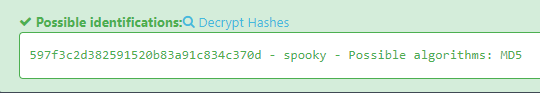

# Task
Oh no! Our 3rd party jack-o-security vendor just informed us that one of our employee's here at the Haunted Brewery is using an insecure password that was found in a well-known databreach. What is it the employee's password? Provide your answer in plaintext.

Password hash `597f3c2d382591520b83a91c834c370d`

# Write-up
For this task we can use site: https://hashes.com/en/tools/hash_identifier

Flag: `spooky`