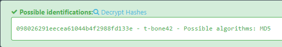

# Task
Oh no! Our 3rd party jack-o-security vendor just informed us ANOTHER of one our employee's is using an insecure password. What is Tony's password ? Provide your answer in plaintext.

Password hash `098026291eecea61044b4f2988fd133e`

# Write-up
For this task we can use site: https://hashes.com/en/tools/hash_identifier

Flag: `t-bone42`
