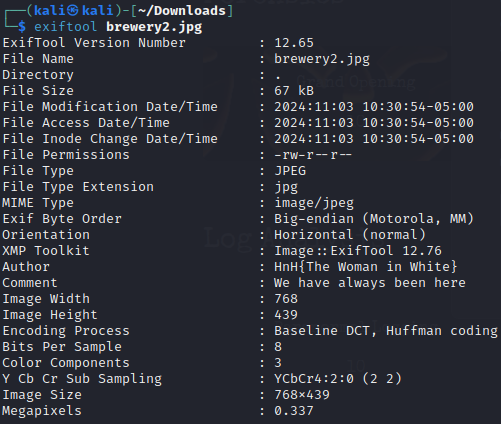

# Task
This image was taking on our friends-and-family opening night about a month ago. There's been chatter on social media that something has "appeared" in the photo that wasn't there before.

Find the identity (flag) of the figure has recently appeared in the photo.

# Write-up

we can use `exiftool` for this file 

Flag: `HnH{The Woman in White}`