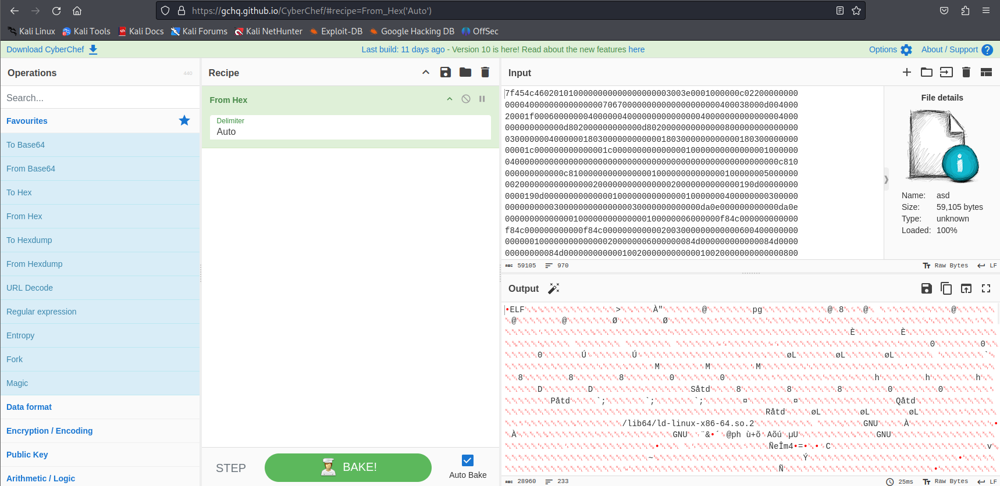
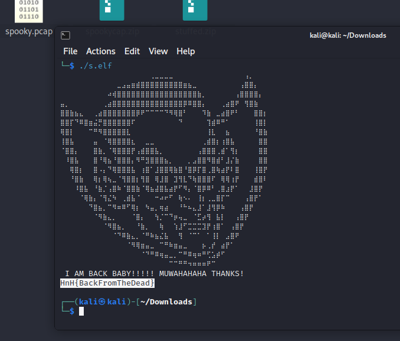

# Task
As you make your way into the crypt you cough and wheeze as your eyes adjust to a dark room. The only light source is a dim flame near a large steel coffin.

A ghostly voice says, "Release meeeeee.... and I will help chase off these amateur ghosts ruining your beer.... release meeeeeeee".

You approach to see a sign that reads: "Within we have buried the count. We are sure he will never get out. Do not make the mistake of releasing him!"

"Should you encounter another vampire, do as we did! We put a giant STAKE into the heart of him... rolled him facedown and then put him in the coffin backwards!"

As you read the sign the a ghostly hand from behind you makes a motion near the coffin, and the lid unlocks with a thud.

# Write-up

```py
"Should you encounter another vampire, do as we did! We put a giant STAKE into the heart of him... rolled him facedown and then put him in the coffin backwards!"
```

first, let's look at this quote, from here we can conclude that the code is in the  it is written in reverse order and a `STAKE` is inserted into it

```bash
rev coffin.txt > temp_coffin.txt
tac temp_coffin.txt > coffin_bin.txt
```

after this we can delete strings `STAKESTAKESTAKE...` in file coffin_bin.txt

and use recipe we can create ELF file





Flag: `HnH{BackFromTheDead}`