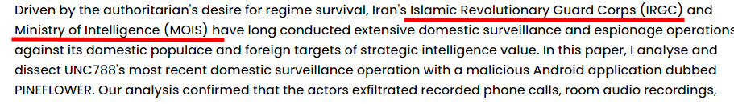

# Task
After finding HilalRAT on our phones, we're sure that UNC788 are the ones attacking us. In our research we found that UNC788 is but a subcomponent of a more nefarious regime.

Which government entity is UNC788 backed by? Provide the acronym without punctuation as your answer. (Multiple answers will be accepted)

Flag format: `HnH{goverment-entity-abreviated}`

# Write-up
We can find information on site - https://vblocalhost.com/conference/presentations/unc788-irans-decade-of-credential-harvesting-and-surveillance-operations/

Flag: `HnH{MOIS}` || `HnH{IRGC}`