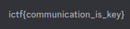

Let's open the discord and you can find our flag in the `emoji`

Flag `ictf{D1sC0rD_Fl@g_0n_Disc0Rd???}`

You can also find a flag in the description of one of the branches (I don't remember which of the flags is correct xD)

Flag `ictf{communication_is_key}`
