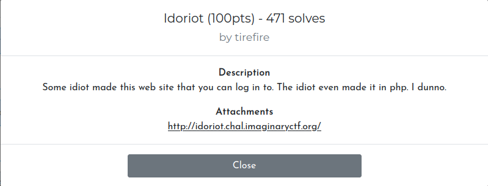
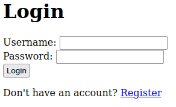
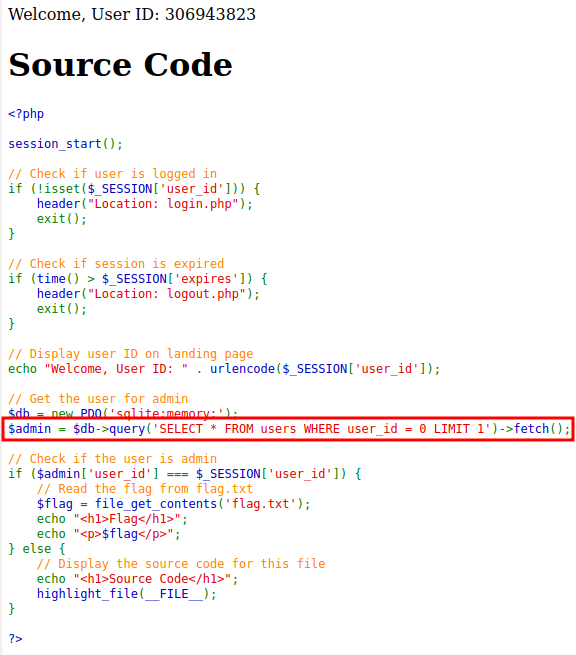
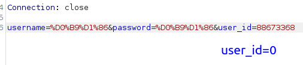
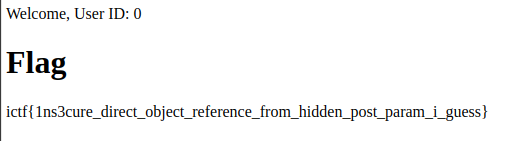

If we follow the link, we will see the usual authorization form 

Next, click on "Register" and create an account with a random name and password
We will see a code in which we will be interested in the selected line. It means that the user "admin" is set to "user_id" = 0. Further, if the "session_id" and "user_id" of the admin are the same, then the flag is displayed

Go to Burp Suit and change "session_id"

and get the flag

