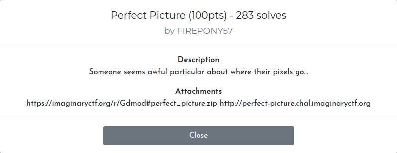
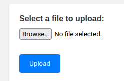
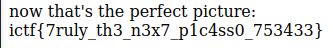

Download the archive, opening the `app.py` file you can see the following function, which checks the loaded image and returns a flag.

```
def check(uploaded_image):
    with open('flag.txt', 'r') as f:
        flag = f.read()
    with Image.open(app.config['UPLOAD_FOLDER'] + uploaded_image) as image:
        w, h = image.size
        if w != 690 or h != 420:
            return 0
        if image.getpixel((412, 309)) != (52, 146, 235, 123):
            return 0
        if image.getpixel((12, 209)) != (42, 16, 125, 231):
            return 0
        if image.getpixel((264, 143)) != (122, 136, 25, 213):
            return 0

    with exiftool.ExifToolHelper() as et:
        metadata = et.get_metadata(app.config['UPLOAD_FOLDER'] + uploaded_image)[0]
        try:
            if metadata["PNG:Description"] != "jctf{not_the_flag}":
                return 0
            if metadata["PNG:Title"] != "kool_pic":
                return 0
            if metadata["PNG:Author"] != "anon":
                return 0
        except:
            return 0
    return flag
```

In order to complete this task, we will write a mini-code in `Python` to create an `image`, and also add the `metadata` we need.

```
from PIL import Image
def create_image():
    width = 690
    height = 420
    new_image = Image.new("RGBA", (width, height), (255, 255, 255, 255))
    new_image.putpixel((412, 309), (52, 146, 235, 123))
    new_image.putpixel((12, 209), (42, 16, 125, 231))
    new_image.putpixel((264, 143), (122, 136, 25, 213))
    return new_image
created_image = create_image()
created_image.save("created_image.png")
```

```
exiftool -Author="anon" created_image.png 
exiftool -Title="kool_pic" created_image.png 
exiftool -Description="jctf{not_the_flag}" created_image.png 
```

Next, upload this image to the site and get the `flag`




Flag `ictf{7ruly_th3_n3x7_p1c4ss0_753433}`
