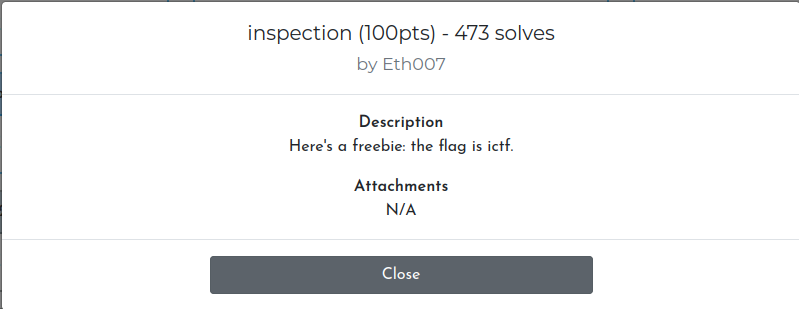
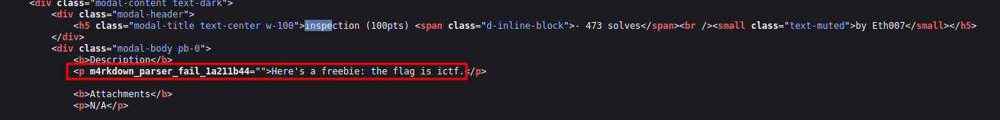

After reading the task, you can understand that somewhere there is a flag
Let's open the page code
Let's find this task
And in one of the tags you can see that the description of the task is placed under a strange name
This is our flag

