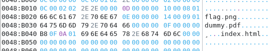
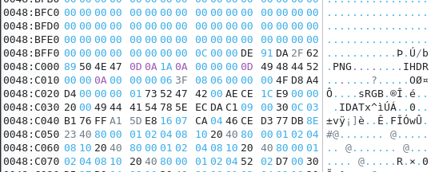
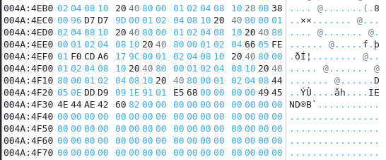

Open the first file `img1` with a HEX editor, in my case it is `Okteta`
Scrolling down you can see that there is a mention of `flag.png`. It seems to me that this means that there will be a picture with a flag below.

And really squandered, you can meet the first bytes of the picture. Knowing the [signature](https://en.wikipedia.org/wiki/List_of_file_signatures) of a png file, you can understand what next will be the bytes responsible for the png image. Let's copy these bits up to the address `004A:4F30` (the last bits of the file -> `4E 44 AE 42 60 82`). And by saving this file with the `.png` extension, you can see the flag.

Flag `ictf{revver_is_a_palindrome}`
