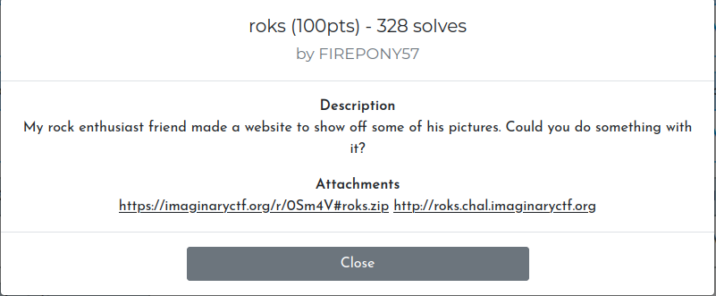
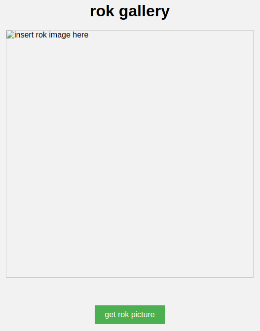
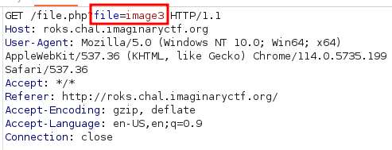
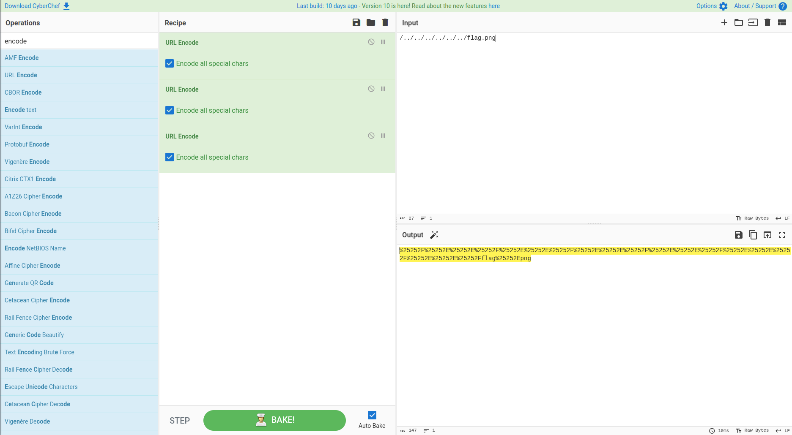
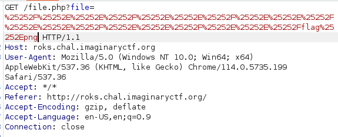
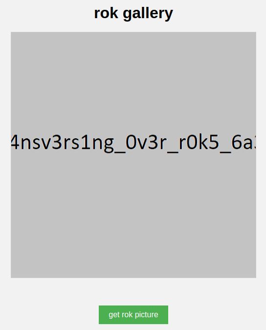

Open the site with the task in Burp Suite and click on the `get rock picture` button

You can see that we are trying to open `image3`. This is similar to `LFI`. Let's try to use `URL Encode` in `CyberChef`. It is necessary to do this coding several times.

Paste the resulting text into Burp Suite in the `file=` field and get our flag

Flag `ictf{tr4nsv3rs1ng_0v3r_r0k5_6a3367}`
