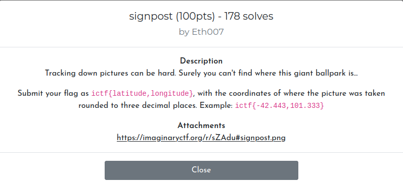
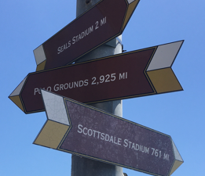
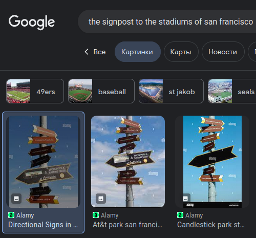
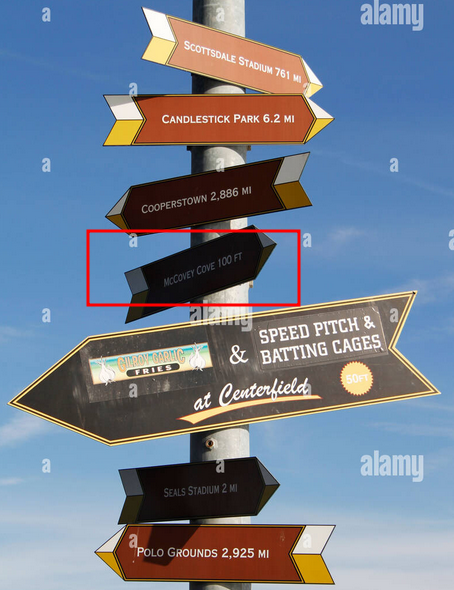
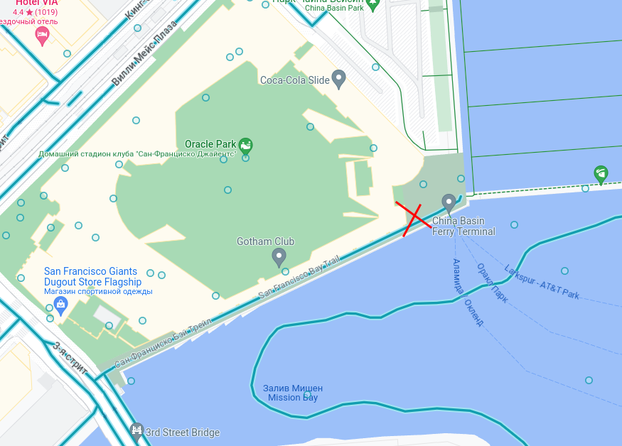
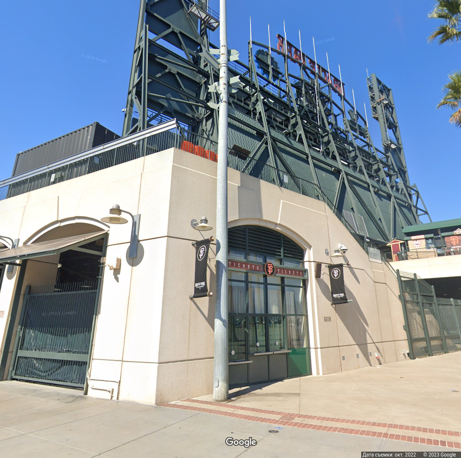
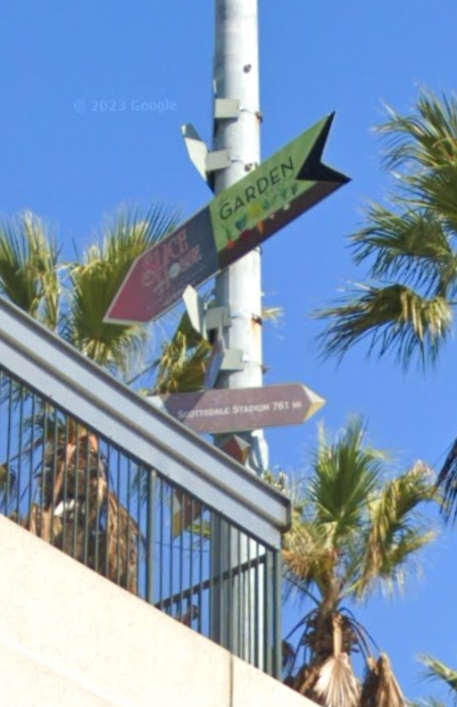

Open image and see our signpost

If we search text on our signpost. We can understand that this signpost indicate on `stadiums in San Francisco`. 

We can find text `McCovey Cove`. if we go there we can find stadium. if we walk around it we can find a signpost.

Our coordinates -> `37.778, -122.388`

Flag `ictf{37.778, -122.388}`
